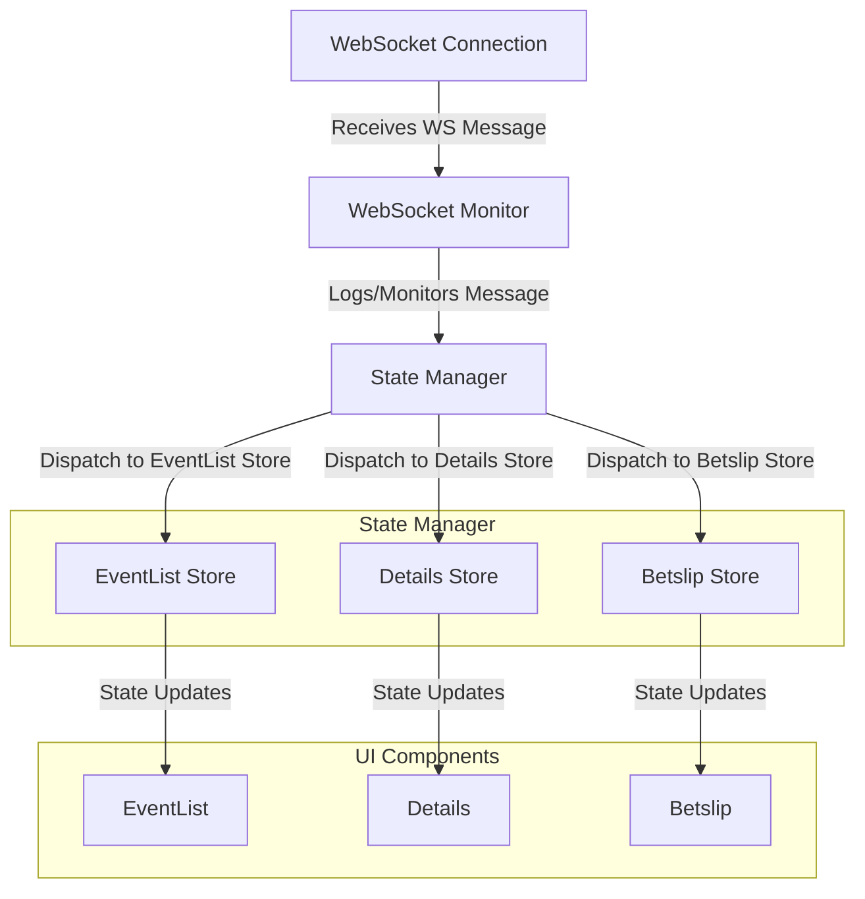

# WebSocket Message Propagation Diagram

### Explanation of the WebSocket Monitor:

1. **WebSocket Monitor**:
    - The WebSocket Monitor acts as an intermediary between the WebSocket Connection and the State Manager.
    - Its function may include:
        - Logging incoming messages.
        - Monitoring and debugging WebSocket communication.
        - Possibly transforming or validating the data before passing it to the State Manager.

2. **WebSocket Connection**:
    - WebSocket messages initially arrive at this point before being routed through the WebSocket Monitor.

3. **State Manager**:
    - The State Manager remains the central hub for processing WebSocket messages and dispatching the update to relevant stores.

4. **UI Components**:
    - The components (EventList, Details, Betslip) receive state updates from the state stores and render the changes accordingly.

### Updated Workflow:

1. A WebSocket message is received by the **WebSocket Connection**.
2. This message is forwarded to the **WebSocket Monitor** for any monitoring, debugging, or logging purposes.
3. The **WebSocket Monitor** then forwards the message to the **State Manager**.
4. The **State Manager** processes the message and dispatches it to the appropriate state stores:
    - **EventList Store** → Updates `EventList Component`
    - **Details Store** → Updates `Details Component`
    - **Betslip Store** → Updates `Betslip Component`
5. The components reflect the updated states in their respective UIs.

### Usage:
To visualize the above diagram, save this to a Markdown file and use a Markdown viewer with Mermaid support. Alternatively, you can test it using [Mermaid Live Editor](https://mermaid-js.github.io/mermaid-live-editor).